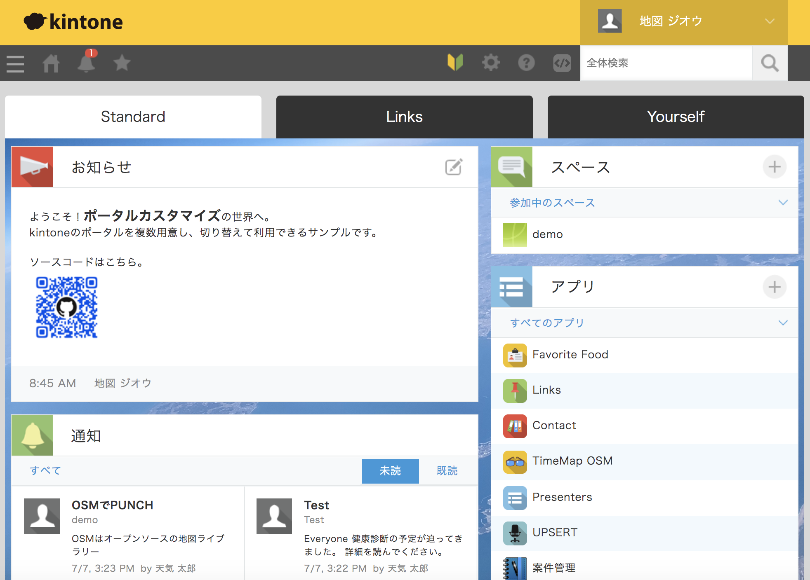
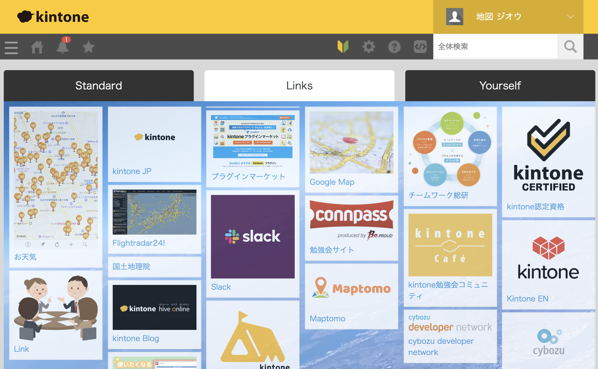
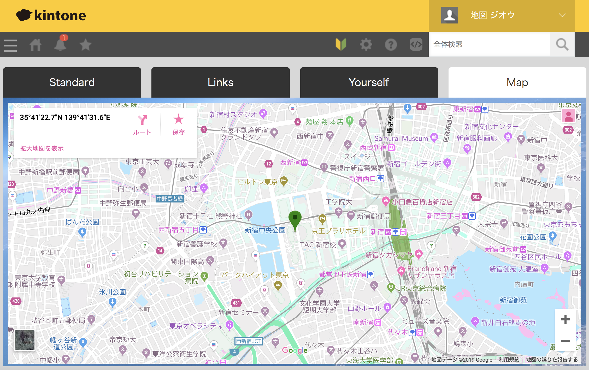

# mt-kinportal

**This sample can switch between multiple kintone portals. It shows three tabs.**

|Link collection|Map (Only capture)|
|---|---|
|||

## Feature
- Tab1: Display kintone's standard widget
- Tab2: Link collection can be displayed with image from kintone application
    - Link name, URL, Image link
- Tab3: Challenge yourself!!

## Pre
- kintone
    - [Trial JP](https://kintone.cybozu.co.jp/trial/) or [Developer license JP](https://developer.cybozu.io/) 
    - [Developer license EN](https://developer.kintone.io/) 
- Chrome
- Chrome Extensions
    - [kintone Portal Designer](https://chrome.google.com/webstore/detail/kintone-portal-designer/kmedncknheiegbelfmcfdlpcpfbnklmo)

## Quick Start part1
1. Upload and save to kintone system management JS / CSS import
- [mt-kinportal_desktop.js](mt-kinportal_desktop.js)
- [mt-kinportal_mobile.js](mt-kinportal_mobile.js)

## Quick Start part2

1. Load a template into kintone and create an app
- [portal_link.zip](app/portal_link.zip) 
- Confirm application ID from URL  
~~~sh
ex. https://{subdomain}.kintone.com/k/{appId}
ex. https://{subdomain}.cybozu.com/k/{appId}
~~~

2. Open kintone Portal Designer and import JSON file
- [mt-kinportal.json](mt-kinportal.json) 

3. Change the source code in the JavaScript tab
~~~JavaScript
  // Tab2 --------------------------------------------
  var query = {
    'app': 20, //appID <<< Change to appId
    'query': 'order by Update_day desc',
    'size': 100 //max 500
  };
~~~

## Reference
- [kintone portal API (portal.show|mobile.portal.show)](https://developer.cybozu.io/hc/ja/articles/360028785452) 
- [Maptomo Blog - mt-kinportal](https://maptomo.com/mt-kinportal)

## Licensing
Licensed under the [MIT License](/LICENCE).

In this sample, kintone class names are obtained and customized, and specification changes may cause it to become inoperable. Use at your own risk.

## Author

[Maptomo](https://maptomo.com/)

